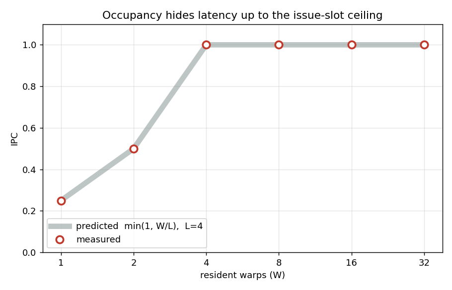
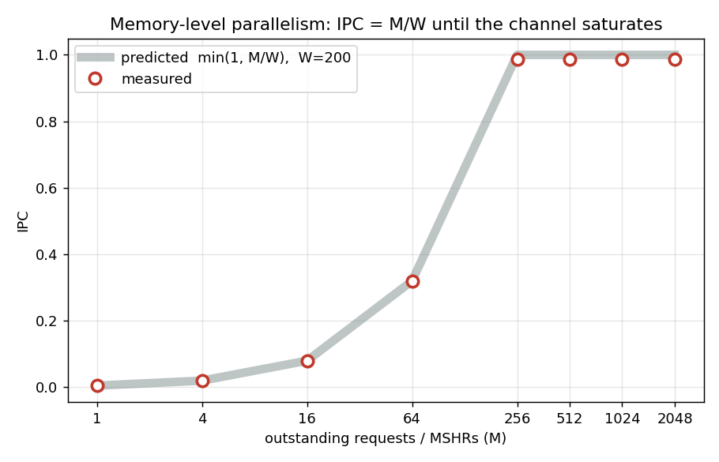
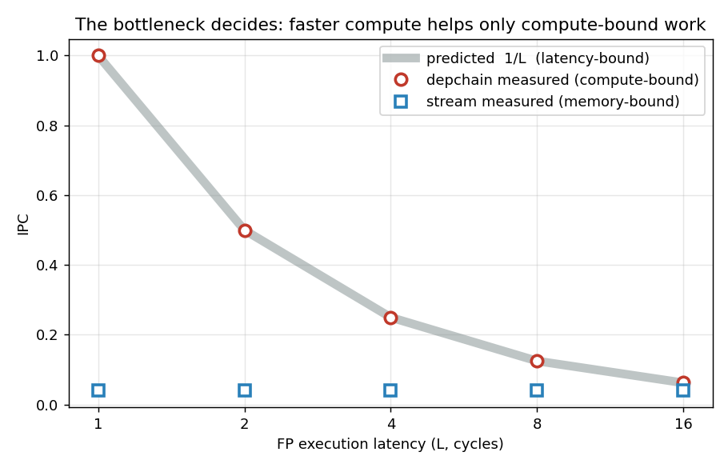

# WarpSim

A configurable, cycle-level simulator of a single GPU streaming multiprocessor (SM),
built to study latency hiding, resource contention, and throughput bottlenecks. The
goal is not to emulate a real GPU or CUDA, but to answer architecture questions
quantitatively: when does adding occupancy help, when does it stop, and what actually
limits throughput — compute, scheduling, memory-level parallelism, or bandwidth.

## What makes this different: validation-first

Every architectural feature is validated against a closed-form analytical prediction
derived by hand *before* trusting the simulator. A result is only accepted when the
measured number matches the prediction. This keeps the model falsifiable rather than
a self-fulfilling toy: it is easy to build a simulator that "runs" and simply
rediscovers whatever behaviour its parameters encode. Each result below is backed by
a deterministic test asserting the closed form.

## Results

The simulator reproduces five fundamental architectural behaviours, each matching a
hand-derived prediction:

| Behaviour | Prediction | Measured |
| --- | --- | --- |
| Dependent instruction chain (no overlap) | IPC = 1/L | 0.2500 (L=4) |
| Independent stream (full overlap) | IPC = N/(N-1+L) | 0.9970 |
| Occupancy hides latency, to a ceiling | IPC -> min(1, W/L) | 0.25, 0.50, 1.00, 1.00 (W=1,2,4,8) |
| Outstanding-request limit (Little's Law) | IPC -> M/W | 0.1000 (M=10, W=100) |
| Bandwidth vs coalescing | drain = ceil(txns/B) | 16x penalty, uncoalesced vs coalesced |

The occupancy result is the central one: throughput climbs with resident warps until
the issue slot saturates, after which additional occupancy provides no benefit. The
outstanding-request result explains *why* real GPUs keep many warps resident —
memory-level parallelism, and therefore latency hiding, is bounded by the number of
in-flight requests the memory system permits (Little's Law: throughput =
concurrency / latency).

## Architecture

The simulator advances cycle by cycle. Each cycle a round-robin scheduler scans the
resident warps and issues from the first eligible one into each available issue slot.
A warp is eligible when its next instruction's source registers are ready (tracked by
a per-warp scoreboard) and the resource it needs is available.

Memory is modelled in three stages that compose:

- **Coalescing**: the per-lane addresses of a warp's memory access collapse into the
  distinct cache lines they touch. Contiguous access yields one transaction; strided
  access yields up to one per lane.
- **L1 cache**: a set-associative, LRU cache. A hit returns quickly; a miss goes to
  DRAM.
- **DRAM**: fixed latency, a finite number of outstanding requests (MSHRs), and a
  bandwidth limit that serialises transactions. A miss must find a free MSHR and
  available bandwidth or the warp stalls.

Modelling choices are deliberately simplified and documented in the source where they
matter (for example, a coalesced access resolves hit/miss at its base line; bandwidth
uses a serialised-channel drain model). The intent is to expose the governing
principles, not to reproduce a specific device.

## Configurable parameters

Execution: FP/INT latency, issue width. Occupancy: number of resident warps, warp
size. Memory: L1 size, associativity, line size, hit latency, DRAM latency,
outstanding-request limit (MSHRs), DRAM bandwidth.

## Repository layout

    include/warpsim/   headers (types, config, cache)
    src/               simulator core and cache implementation
    tests/             deterministic closed-form validation tests

## Building and testing

    cmake -S . -B build && cmake --build build && ctest --test-dir build

All tests are deterministic and assert closed-form predictions.

## Development

Built incrementally, one architectural feature at a time, with each version committed
only after its validation test passed:

- v0: cycle engine + scoreboard
- v1: multiple warps + round-robin scheduling + latency hiding
- v2: per-lane addresses + coalescing + set-associative L1
- v3: outstanding-request limit + DRAM bandwidth

## Experiments

Each experiment sweeps one architectural parameter and overlays the measured IPC on a
closed-form prediction derived by hand. The measured points sit on the predicted curve
in every case, which is the evidence that the model reflects the intended mechanism
rather than an artifact of its parameters.

### Occupancy and latency hiding

A dependent-instruction workload run with increasing resident warps. A single warp
stalls on its own dependencies and reaches only IPC = 1/L. Adding warps lets the
scheduler issue from other warps during those stalls, so throughput climbs and then
saturates once the single issue slot is full. Prediction: IPC -> min(1, W/L). The knee
sits exactly at W = L, which is the number of warps needed to fully hide the latency.

### Memory-level parallelism (Little's Law)

A streaming (memory-bound) workload with the L1 disabled, sweeping the number of
permitted outstanding memory requests (MSHRs). Throughput rises linearly with
in-flight requests, matching Little's Law (throughput = concurrency / latency = M/W),
until the memory channel itself saturates. The ceiling here is one access per cycle,
a consequence of the simplified serialised-channel bandwidth model; a multi-issue
channel would raise it. This is the mechanism behind keeping many warps resident on
real GPUs: latency hiding is bounded by the outstanding-request limit.

### Bottleneck identification

The same knob (FP execution latency) applied to two workloads. The latency-bound
dependent chain responds directly (IPC = 1/L), while the memory-bound stream is
unaffected because its bottleneck is memory, not compute. This is the core
performance-analysis skill the simulator is built to demonstrate: adding execution
resources helps only when execution is actually the bottleneck.

## Note on the GEMM workload and cache experiments

The bundled "gemm" workload is a compute-heavy instruction mix, not a tiled matrix
multiply with genuine data reuse. As a result the workloads here have little temporal
locality, so an L1-capacity sweep would (correctly) show almost no sensitivity to cache
size. Rather than construct an artificial reuse pattern to force a curve, this is left
as noted: cache-capacity effects require a workload with real reuse, which is future
work.
